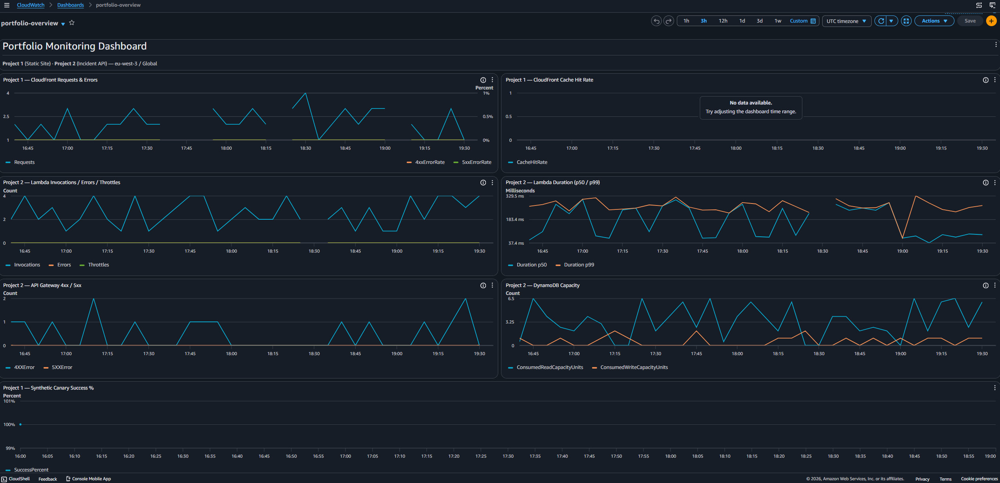
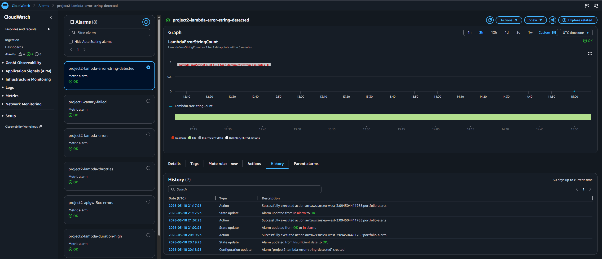
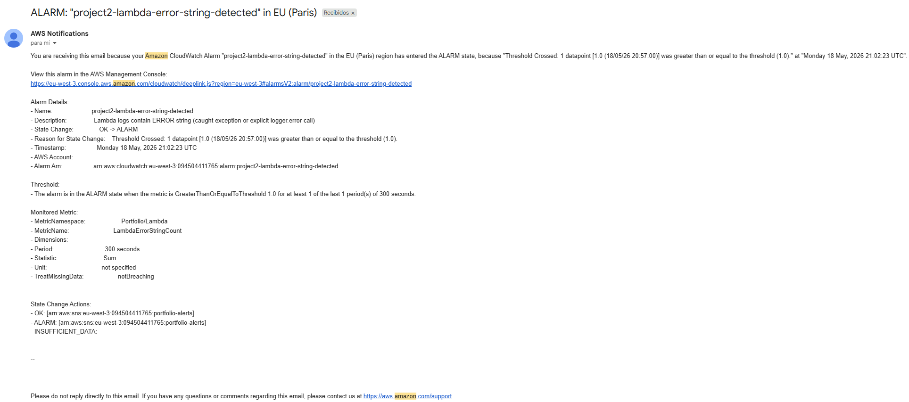
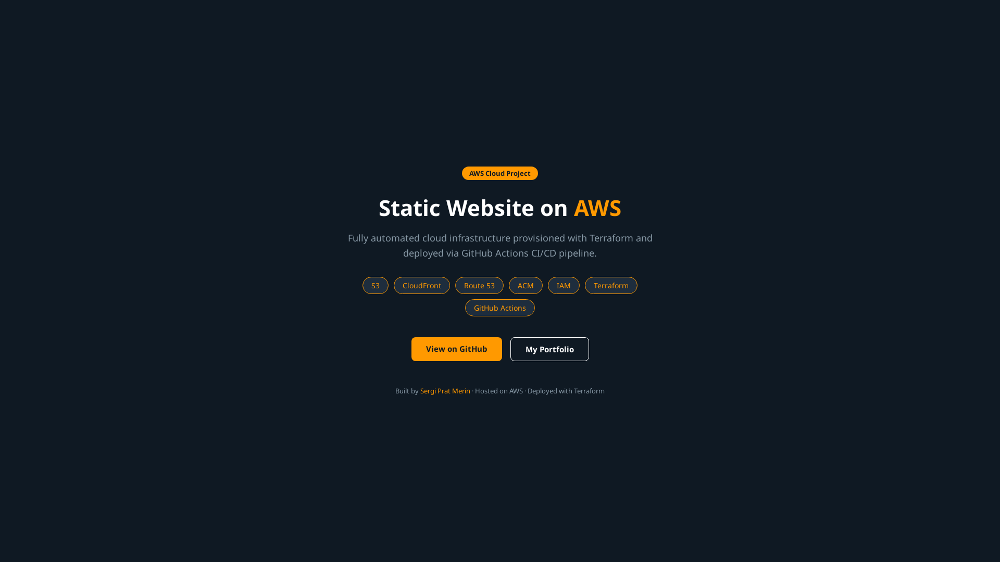
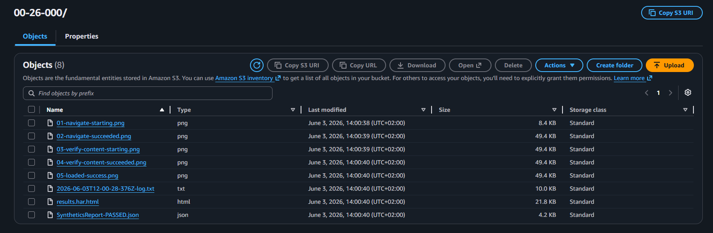
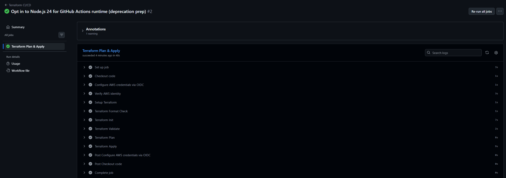

# 📊 Cloud Monitoring & Alerts — CloudWatch Observability on AWS

[]()
[]()
[]()
[]()
[]()
[]()

Production-grade observability for my AWS portfolio: 10 CloudWatch alarms, a synthetic canary, a unified dashboard and SNS email alerts — all defined as Terraform, deployed via GitHub Actions OIDC, costing essentially **$0/month**.

This project monitors my two live portfolio services:
- **Project 1** — Static site at [project1.sergipratmerin.com](https://project1.sergipratmerin.com)
- **Project 2** — Incident API at [api.project2.sergipratmerin.com/incidents](https://api.project2.sergipratmerin.com/incidents)

---

## 📐 Architecture

```
        ┌─────────────────────────────────────────────────────────┐
        │                    PORTFOLIO SERVICES                    │
        │                                                          │
        │   Project 1                       Project 2              │
        │   ─────────                       ─────────              │
        │   CloudFront ──┐              ┌── API Gateway            │
        │       │        │              │       │                  │
        │       ▼        │              │       ▼                  │
        │       S3       │              │   Lambda ──► DynamoDB    │
        │                │              │                          │
        └────────────────┼──────────────┼──────────────────────────┘
                         │              │
                         │              │ (metrics + logs)
                         ▼              ▼
                ┌─────────────────────────────────┐
                │      CloudWatch (this project)   │
                │  ┌───────────────────────────┐  │
                │  │  10 Alarms                │  │
                │  │  Log Metric Filter        │  │
                │  │  Dashboard                │  │
                │  │  Synthetics Canary 4×/day │  │
                │  └─────────────┬─────────────┘  │
                └────────────────┼────────────────┘
                                 │
                                 ▼
                ┌─────────────────────────────────┐
                │   SNS (eu-west-3 + us-east-1)    │
                └────────────────┬────────────────┘
                                 │
                                 ▼
                            📧 Email
```

### Services used

| Service | Purpose |
|---|---|
| **CloudWatch Alarms** | 10 alarms across Lambda, API Gateway, DynamoDB, CloudFront, canary, billing |
| **CloudWatch Logs Metric Filter** | Catches `ERROR` strings in Lambda logs (caught exceptions invisible to standard metrics) |
| **CloudWatch Dashboard** | 7-widget unified view of both portfolio projects |
| **CloudWatch Synthetics** | Headless Chrome canary verifies static site is reachable AND renders correctly |
| **SNS** | Pub/sub alert delivery to email (cross-region: eu-west-3 + us-east-1) |
| **S3** | Stores canary screenshots and HAR files with 30-day lifecycle |
| **IAM + OIDC** | GitHub Actions assumes role via OIDC — no long-lived AWS keys |
| **Terraform** | Infrastructure as Code — all resources defined in HCL across modular `.tf` files |
| **GitHub Actions** | CI/CD pipeline with `plan` on PR, `apply` on merge to main |

---

## 🚨 Alarms inventory

All 10 alarms are within the CloudWatch free tier (10 alarms/month). One alert email landed in my inbox during testing, confirming the full pipeline works end-to-end.

### Project 1 — Static site

| Alarm | Trigger | Region |
|---|---|---|
| `project1-canary-failed` | Synthetics canary run failed | eu-west-3 |
| `project1-cloudfront-5xx-errors` | CloudFront 5xx rate > 1% sustained 10min | us-east-1 |

### Project 2 — Serverless API

| Alarm | Trigger | Region |
|---|---|---|
| `project2-lambda-errors` | Any uncaught Lambda exception | eu-west-3 |
| `project2-lambda-throttles` | Lambda concurrency limit hit | eu-west-3 |
| `project2-lambda-duration-high` | p99 duration > 3s sustained 10min | eu-west-3 |
| `project2-lambda-error-string-detected` | `ERROR` string in Lambda logs | eu-west-3 |
| `project2-apigw-5xx-errors` | API Gateway returned 5xx | eu-west-3 |
| `project2-apigw-4xx-elevated` | >10 4xx in 5min sustained 10min (abuse detection) | eu-west-3 |
| `project2-dynamodb-throttles` | DynamoDB throttled a request | eu-west-3 |

### Account-wide

| Alarm | Trigger | Region |
|---|---|---|
| `billing-alarm-1usd` | Estimated AWS charges exceed $1 USD | us-east-1 |

---

## 📁 Project structure

```
.
├── .github/
│   └── workflows/
│       └── terraform.yml          # GitHub Actions CI/CD with OIDC
├── terraform/
│   ├── backend.tf                 # S3 remote state
│   ├── providers.tf               # eu-west-3 + us-east-1 (alias)
│   ├── variables.tf
│   ├── terraform.tfvars.example   # Public template
│   ├── data.tf                    # Look up Project 2 resources
│   ├── sns.tf                     # 2 SNS topics + email subscriptions
│   ├── synthetics_canary.tf       # Canary + S3 + IAM
│   ├── canary_script.js           # The actual Puppeteer canary code
│   ├── alarms_project1.tf         # CloudFront 5xx
│   ├── alarms_project2.tf         # Lambda + API GW + DynamoDB alarms
│   ├── alarms_billing.tf          # Cost guardrail
│   ├── log_metric_filter.tf       # ERROR string → custom metric → alarm
│   ├── dashboard.tf               # 7-widget CloudWatch dashboard
│   ├── github_oidc.tf             # GitHub Actions OIDC provider + role
│   └── outputs.tf
└── README.md
```

---

## 💰 Cost analysis

**Target: $0/month.**
**Actual: ~$0.30/year** (rounds to $0).

| Resource | Monthly cost | Notes |
|---|---|---|
| 10 CloudWatch alarms | $0 | Free tier: 10 alarms/month |
| 3 dashboards | $0 | Free tier: 3 dashboards |
| 1 custom metric (ERROR string) | $0 | Free tier: 10 custom metrics |
| SNS email notifications | $0 | Free tier: 1,000/month |
| S3 (canary artifacts) | $0 | <10 MB with 30-day lifecycle |
| CloudWatch Logs | $0 | <100 MB total |
| Synthetics canary | **~$0.024** | 120 runs/month, 100 free → 20 × $0.0012 |
| IAM, OIDC, KMS | $0 | All free |

The billing alarm at $1 USD threshold enforces this — if any cost regression happens, I get an email within 6 hours.

---

## 🚀 Getting started

### Prerequisites

- Terraform 1.0+
- AWS CLI configured
- An AWS account with the prerequisite resources from Projects 1 & 2 (or modify variables to point at your own)
- A GitHub repository for CI/CD (optional, for the OIDC workflow)

### 1. Clone

```bash
git clone https://github.com/Drakeshh/aws-monitoring-terraform.git
cd aws-monitoring-terraform
```

### 2. Configure

```bash
cd terraform
cp terraform.tfvars.example terraform.tfvars
# Edit terraform.tfvars with your email and CloudFront ID
```

### 3. Deploy

```bash
terraform init
terraform plan
terraform apply
```

### 4. Confirm SNS subscriptions

Check your email for **two** confirmation messages (one per region) and click both links.

### 5. (Optional) Set up GitHub Actions

Add these repository secrets in **Settings → Secrets and variables → Actions**:

- `ALERT_EMAIL` — your alert email
- `CLOUDFRONT_DISTRIBUTION_ID` — your CloudFront ID

No `AWS_ACCESS_KEY_ID` needed — authentication uses OIDC.

---

## ⚙️ CI/CD pipeline

```
push or PR to main
     │
     ├── 1. Checkout code
     ├── 2. Assume AWS role via OIDC (no static credentials!)
     ├── 3. terraform fmt -check (warns only)
     ├── 4. terraform init
     ├── 5. terraform validate
     ├── 6. terraform plan
     └── 7. terraform apply  ← only on push to main, skipped on PR
```

---

## 🔐 Security highlights

- **OIDC authentication for CI/CD** — no long-lived AWS keys stored in GitHub. Workflows mint short-lived JWTs that AWS exchanges for ~1-hour credentials. The IAM role's trust policy is locked to this specific repo (`repo:Drakeshh/aws-monitoring-terraform:*`).
- **Modular IAM policies** — added permissions are in a separate `terraform-deployer-monitoring-policy` rather than appended to the existing policy. Easy to audit and remove.
- **Least-privilege canary role** — canary's IAM policy uses a condition to restrict CloudWatch metric writes to its own namespace.
- **S3 public access fully blocked** — defense-in-depth on the canary artifacts bucket.
- **All resources tagged** via Terraform `default_tags` — cost tracking and ownership clarity.

---

## 💡 Lessons learned

A few real things I learned building this:

### AWS Synthetics has an undocumented schedule limit

I initially set the canary to `rate(6 hours)`, expecting it to behave like any other CloudWatch rate expression. The apply failed with `Invalid Schedule Expression`. Turns out **Synthetics caps `rate(...)` at 1 hour**, regardless of what general CloudWatch accepts. Switched to a cron expression (`cron(0 0,6,12,18 * * ? *)`) which has no such limit and runs 4×/day as intended.

### Multiple AWS services publish metrics only to us-east-1

CloudFront, Route53 health checks, and AWS/Billing all publish their metrics exclusively to us-east-1, no matter where your resources actually live. This meant configuring a second AWS provider with an alias and creating a separate SNS topic in us-east-1 (cross-region SNS publishing isn't allowed). It's worth knowing this regional quirk before designing cross-region monitoring.

### Log metric filters catch what error metrics miss

The standard `AWS/Lambda Errors` metric only increments on **uncaught** exceptions. Well-written Lambda code catches errors and returns 5xx responses, which leaves no signal in that metric. A log metric filter watching for `ERROR` strings in CloudWatch Logs catches these cases — turning application-level logging into alarmable metrics. This is a senior monitoring pattern.

### Outputs aren't saved if apply fails partway

The first apply failed on the canary (the rate-expression issue). After fixing and re-applying, the resources existed but `terraform output` returned nothing. Outputs are only written at the end of a successful apply, so a partial-success apply leaves the state file without them. Fixed with `terraform refresh` (which recomputed and stored them).

### OIDC is dramatically better than static keys, and not much harder to set up

The whole OIDC setup — provider, role, trust policy, workflow integration — took about 15 minutes. I migrated to it for Project 3 after using static `AWS_ACCESS_KEY_ID` secrets for Projects 1 and 2. The security upgrade (no leakable long-lived credentials in GitHub) is large compared to the setup time.

---

## 📸 Screenshots

Real evidence from the running system — captured after the project had been deployed and the canary had been running unattended for two weeks.

### CloudWatch Dashboard
Unified view of both portfolio services. CloudFront request volume, Lambda invocations and duration percentiles, API Gateway 4xx/5xx, DynamoDB capacity, and canary success rate — all in one pane. The flat 100% on the canary widget reflects continuous uptime across every scheduled run since deployment, which is exactly what you want to see in production monitoring.



### End-to-end alert pipeline (verified)

The full pipeline — `Lambda log → CloudWatch metric filter → alarm → SNS → email` — was validated by intentionally writing an `ERROR` log line to the Lambda's log group. Within ~3 minutes the alarm transitioned `OK → ALARM`, fired the SNS topic, and delivered an email. The alarm then auto-resolved a few minutes later, demonstrating both the trigger and recovery paths work.

**Alarm state history showing the full lifecycle:**



**The actual alert email received in Gmail:**



### Synthetics canary

A headless Chrome canary navigates to the live static site 4 times a day (cron-scheduled at 00:00 / 06:00 / 12:00 / 18:00 UTC), verifies HTTP 200, confirms the page body actually rendered, and stores artifacts in S3 with a 30-day lifecycle policy.

**The canary's own screenshot of the live site**, captured automatically during a recent run:



**Each successful run produces 8 artifacts** — step-by-step screenshots, a full HAR file of every browser network request, a run log, and a JSON execution summary. AWS retains successes for 7 days and failures for 31, then S3 lifecycle policies clean them up:



### CI/CD pipeline running with OIDC

GitHub Actions assumes an IAM role via OIDC — no long-lived AWS credentials stored anywhere — and runs `terraform init → validate → plan → apply` on every push to `main`.



---

## 📚 Resources

- [CloudWatch Synthetics](https://docs.aws.amazon.com/AmazonCloudWatch/latest/monitoring/CloudWatch_Synthetics_Canaries.html)
- [GitHub Actions OIDC with AWS](https://docs.github.com/en/actions/deployment/security-hardening-your-deployments/configuring-openid-connect-in-amazon-web-services)
- [Terraform AWS Provider](https://registry.terraform.io/providers/hashicorp/aws/latest/docs)

---

## 📄 License

MIT — see [LICENSE](LICENSE).